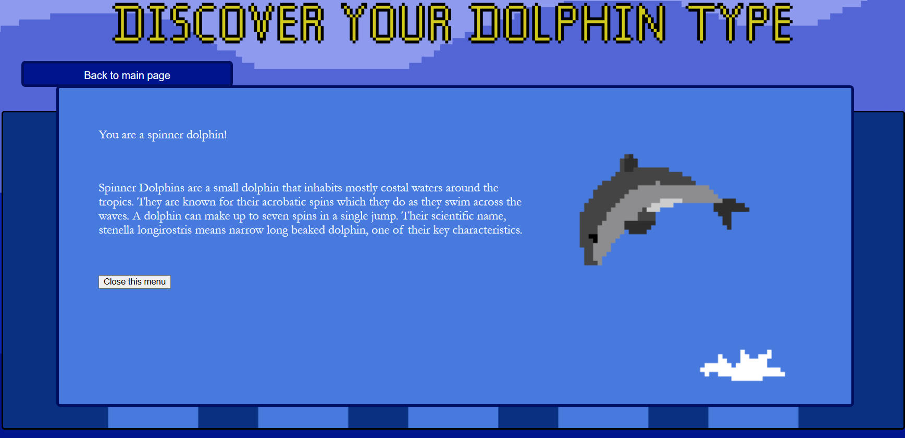
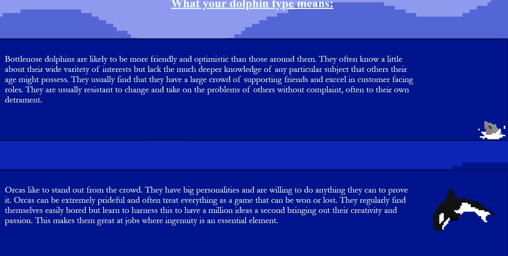

# Overview
This project is a website about Dolphins! The main part of the site is finding your dolphin type. Simply enter your name and discover your dolphin type! However you can also play dolphin games or learn more about dolphins.

# How to play
* First access the website by visting https://thesupernile.github.io/DolphinWebsiteV2/
* Next, click "discover your dolphin type!"
* Then, enter your name in the box labelled "type your name here", press "find out what type of dolphin you are"
* Your dolphin type will pop up with a little information about that dolphin
* Additionally play dolphin themed games by clicking "play epic dolphin games"
* Or view facts by clicking "dolphin facts"

# Features
* Ability to discover your dolphin type by entering your name
* Dolphin Dash, a game about dolphins
* Dolphin facts, including facts about all the possible dolphin types
* Interactive buttons to change which type of dolphin the dolphin facts are about (added dolphins include: Bottlenose, Orca, Spinner and Amazon River)

# Screenshots

Discovering your dolphin type:

Learning more about dolphin types and what they mean:

Dolphin Dash:

Dolphin facts (buttons at the top allow you to swap which dolphin the facts are about):

